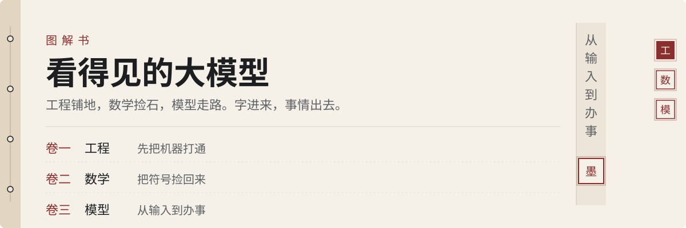
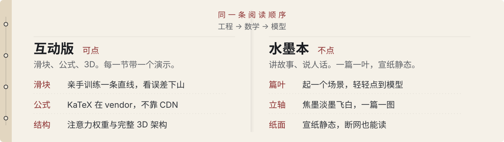
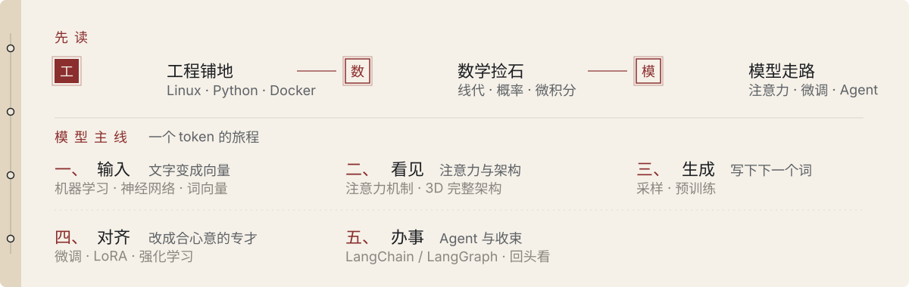

  

一本图解书。先把机器打通，再把符号捡回来，最后看字怎么变成事。

阅读顺序固定：**工程 → 数学 → 模型**。互动版和水墨本走同一条线。

  
  
  

工程 · 先接通  数学 · 符号是路标  模型 · 信封进来，事情出去

  

## 从输入到办事

  

互动版把模型主线拆成可动手的演示：训练一条直线、词向量、注意力、3D 架构、采样、预训练、微调与 LoRA、Agent。水墨本用七个故事讲同一件事，公式都留在互动版。

## 打开

线上从工程页起读：

**https://tsumon.github.io/basics.html**

GitHub Pages 根目录是模型页 [`index.html`](index.html)。顶栏已按工程 → 数学 → 模型排列。

本地把仓库打开即可，不需要服务器或 CDN。KaTeX 在 `vendor/katex`。

| 本子 | 工程（先读） | 数学 | 模型 |
| --- | --- | --- | --- |
| 互动版 | [basics.html](basics.html) | [math.html](math.html) | [index.html](index.html) |
| 水墨本 | [ink-basics.html](ink-basics.html) | [ink-math.html](ink-math.html) | [ink.html](ink.html) |

## 备忘

- [`start-here.html`](start-here.html) 是数学 v2 的快速入口，不是全书封面。
- 旧地址 `doodle.html` / `doodle-math.html` / `doodle-basics.html` 会跳到对应水墨本。
- 互动版用 localStorage 键 `theme` 记深浅色。水墨本是宣纸静态页，没有主题切换。
